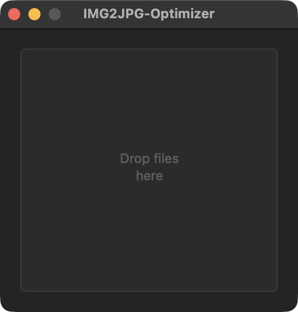

## ⌨️ Install via Homebrew:

brew tap chupchupchup/img2jpg

brew install --cask img2jpg-optimizer

---

# 🖼️ IMG2JPG Optimizer

## ⚡ What is it?
**IMG2JPG Optimizer** is a **macOS Apple Silicon** app (M1, M2, M3, M4) that optimizes your JPEG, PNG, HEIC, GIF, and WebP images by converting them into **optimized progressive JPEGs** using [MozJPEG v4](https://github.com/mozilla/mozjpeg).  

- **Huffman-optimized compression**  
- Progressive JPEGs (better rendering on the web)  
- PNG/HEIC/GIF/WebP → JPEG conversion via built-in **ImageMagick**  
- **Standalone app**  
- Simple interface: **drag-and-drop** designed for macOS Apple Silicon  

---

## 🚀 Why use it?
- Image size reduced by **20–70%** with no visible quality loss  
- Huge time saver when preparing images for the **web**, **presentations**, or **quick sharing**  
- Compatible with all browsers and editors  

---

## 📥 Download
👉 [Latest release (DMG)](https://github.com/chupchupchup/IMG2JPG-Optimizer/releases/latest)  

Installation:  
1. Download the `.dmg`  
2. Drag the app into **Applications**  
3. First run: right‑click → *Open* → *Allow*  

---

## 📸 Screenshots

  
*Drag and drop files into the app*

  
*Display of optimized files with MozJPEG*

---

## 🖥️ Compatibility
- macOS 12+ (Monterey and later)  
- Mac Apple Silicon (M1/M2/M3/M4)  
- No Rosetta needed, all binaries are **native arm64**  

---

## 🙏 Credits
- [Mozilla](https://github.com/mozilla/mozjpeg) for **MozJPEG v4**  
- [ImageMagick](https://imagemagick.org) for multi‑format conversion  
- The open‑source community ✨  

---

In macOS 26 you can authorize the app under **System Settings > Privacy & Security**
and click "Open Anyway".

## 💝 License
Distributed as **Freeware / Donationware**.  
Free to use — you can contribute or donate to support the project.

